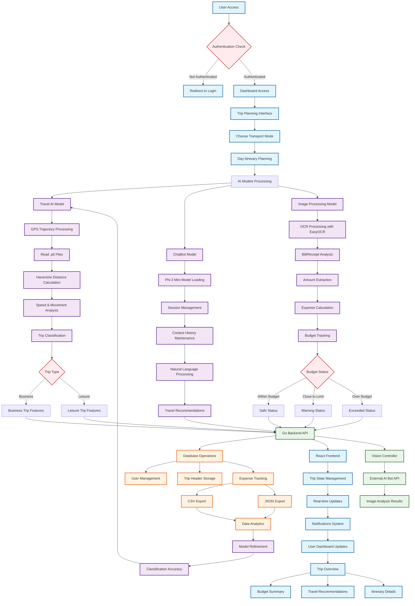

# Trip Tracker Application—Complete Process Flow

## System Architecture Flowchart

## Detailed Process Breakdown

### 1. **User Authentication & Access**
- User attempts to access the application
- Authentication check via JWT tokens
- Redirect to login if unauthorized
- Dashboard access on successful authentication

### 2. **Trip Planning Interface**
- User interacts with travel planning components
- Transport mode selection
- Day-by-day itinerary creation
- Integration with AI models for optimization

### 3. **AI Models Processing Pipeline**

#### **Travel AI Model (`travel_AI.py`)**
- **GPS Trajectory Processing**: Reads .plt files containing GPS coordinates
- **Haversine Distance Calculation**: Computes distances between consecutive points
- **Speed & Movement Analysis**: Calculates speed, time differences, and movement patterns
- **Trip Classification**: Uses Logistic Regression to classify trips as Business or Leisure
- **Feature Extraction**: Analyzes average speed, max speed, and trip length

#### **ChatBot Model (`chatBot.py`)**
- **Phi-3 Mini Model**: Microsoft's language model for travel assistance
- **Session Management**: Maintains separate chat histories per user
- **Context History**: Preserves last 2 exchanges for context
- **Natural Language Processing**: Generates travel recommendations and answers queries
- **FastAPI Integration**: REST API endpoints for chat functionality

#### **Image Processing Model (`image_process.py`)**
- **EasyOCR Integration**: Optical Character Recognition for bill/receipt processing
- **Amount Extraction**: Identifies and extracts monetary amounts from images
- **Budget Tracking**: Maintains cumulative expense tracking
- **Status Classification**: 
  - ✅ Safe (under 80% of budget)
  - ⚠️ Warning (80-100% of budget)
  - ❌ Exceeded (over budget)

### 4. **Backend API Layer (Go)**
- **Echo Framework**: REST API server
- **CORS Configuration**: Cross-origin resource sharing setup
- **Route Management**: Authentication, trip management, and AI integration endpoints
- **Vision Controller**: Handles image upload and processing requests
- **Database Integration**: PostgreSQL/MySQL database operations

### 5. **Frontend Integration (React + TypeScript)**
- **Authentication Context**: User state management
- **Trip State Provider**: Global trip planning state
- **Real-time Updates**: Live budget and expense tracking
- **Responsive UI**: Mobile-first design with desktop support
- **Notification System**: Real-time alerts and updates

### 6. **Data Storage & Analytics**
- **CSV/JSON Export**: Trip trajectory and expense data export
- **Database Persistence**: User data, trip headers, and expense records
- **Model Training Data**: Feedback loop for improving AI model accuracy

## Key Features

1. **Multi-Modal AI Integration**: Combines computer vision, NLP, and trajectory analysis
2. **Real-time Budget Tracking**: Instant expense monitoring with visual status indicators
3. **Intelligent Trip Classification**: Automatic categorization of business vs leisure trips
4. **Interactive Chat Assistant**: AI-powered travel recommendations and support
5. **Cross-Platform Compatibility**: Web-based with mobile-responsive design
6. **Secure Authentication**: JWT-based user authentication and session management
7. **Data Export Capabilities**: CSV and JSON export for external analysis

## Technology Stack

- **Frontend**: React, TypeScript, Tailwind CSS, Vite
- **Backend**: Go (Echo Framework), RESTful APIs
- **AI/ML**: Python (Transformers, scikit-learn, EasyOCR, OpenCV)
- **Database**: PostgreSQL/MySQL
- **Authentication**: JWT tokens with HTTP-only cookies
- **Deployment**: Docker-ready architecture

This flowchart represents the complete end-to-end process flow of your Trip Tracker application, showing how all components interact to provide a comprehensive travel planning and expense management solution.